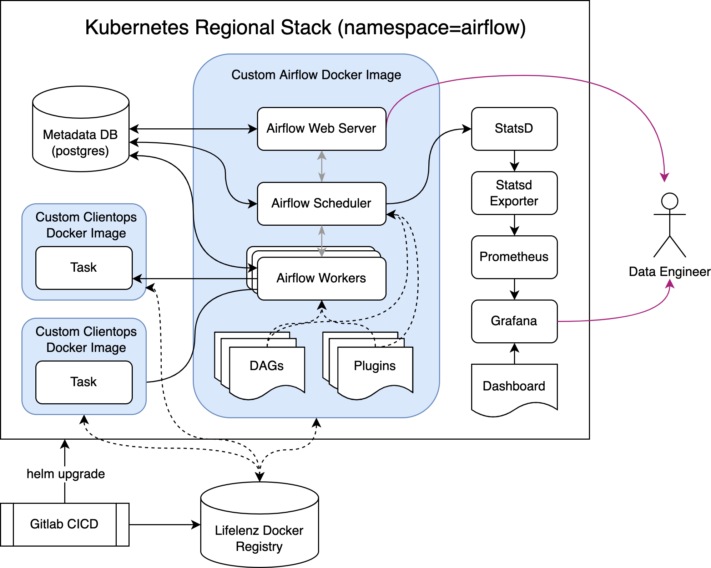

# Airflow Kubernetes

## Quickstart

These instructions are adapted from the [official Airflow documentation](https://airflow.apache.org/docs/helm-chart/stable/quick-start.html).

1. Install the following: [kubectl](https://kubernetes.io/docs/tasks/tools/), [kind](https://kind.sigs.k8s.io/), [helm](https://helm.sh/docs/intro/install/)
2. Set the following environment variables: `export NAMESPACE=example-namespace`, `export RELEASE_NAME=example-release`
3. Create a local Kubernetes cluster using kind by running `make setup`.
4. Install the Airflow stack using `make build`. Verify this: `kubectl get pods --all-namespaces -o wide` should show various pods, which should eventually be in the "Running" state.
5. Forward the relevant ports to your local machine using `make forward-web` ([localhost:8080](http://localhost:8080)) for the Airflow webserver and `make forward-grafana` ([localhost:3000](http://localhost:3000)) for the monitoring dashboard.
6. Additional Makefile commands are described using `make help`.

## Architecture Diagram

## Configuring Airflow Connections (SSH)

The Airflow connection(s) are defined in the `helm/values.yaml` instead of through the web interface. Conn IDs are used in the Python code to reference the connections. See [Connections](https://airflow.apache.org/docs/apache-airflow/stable/concepts/connections.html).

Here, SSH is used as an example connection. Airflow can use an SSH key to access remote machines. For testing purposes, this setup is currently configured to mount a local `.ssh` directory to the docker image specified in `./Dockerfile`, which should contain the private (and public) key (e.g. `id_rsa`, `id_rsa_pub`). Each remote machine that should should allow Airflow to access it should have this public key added to their `authorized_keys` file. If there is no existing ssh key, you can generate one with the `ssh-keygen` command (no password).

## Directory Structure

[Modules management](https://airflow.apache.org/docs/apache-airflow/2.3.2/modules_management.html) in Airflow can be handled in various ways, but by default, Airflow automatically adds the following folders to PYTHONPATH: `plugins`, `dags`, and `config`. This Airflow project places dags in the `dags` folder and utility functions in the `plugins` folder.

## Local Development

### IDE Intellisense

Due to how Airflow handles modules, if using an IDE with some form of intellisense, it will not automatically detect the directories that are automatically added to PYTHONPATH within the Airflow Docker environment. One solution is to configure the IDE to use the Conda environment specified in `environment.yml`, and manually add the plugins directory to PYTHONPATH using `conda develop plugins`. The source code is formatted using [Black](https://github.com/psf/black) and linted with flake8 using the `.flake8` configuration file.

### Hot reloading

The Makefile is configured to allow for local dag development if the environment variable LOCAL is not empty (default: TRUE). This means that when you save a dag, it is automatically updated in the running containers. This makes use of Persistent Volume Claims, as documented in the official [Airflow Helm Chart documentation](https://airflow.apache.org/docs/helm-chart/stable/manage-dags-files.html#mounting-dags-from-an-externally-populated-pvc).

Note: Using Kubernetes in local development was chosen over using a docker-compose file, so that a separate docker-compose does not have to be maintained. However, if you need to use docker-compose for whatever reason, the [default docker-compose file](https://airflow.apache.org/docs/apache-airflow/2.3.2/docker-compose.yaml) from Airflow should be usable with little to no modification.

## Troubleshooting

If workers/pods unexpectedly die, increase the memory given to Docker. If unknown issues occur during build stage, clean and try again. Otherwise, if unsalvagable, nuke and restart.
